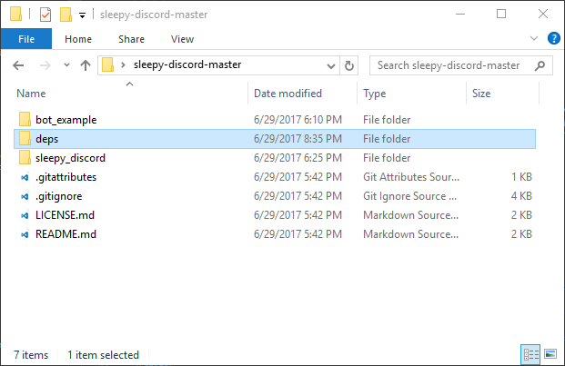
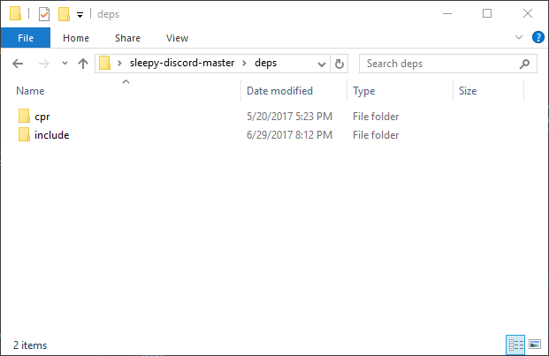

[⮌ Go back to documentation](documentation.html)

#How to Compile
<aside class="notice">
The first step to using Sleepy Discord
</aside>

##Downloading Sleepy Discord
<strike>First, go to https://github.com/NoNamer64/sleepy-discord and click clone then Download Zip.</strike>

[Just click here.](https://github.com/NoNamer64/sleepy-discord/zipball/master)

Then unzip it by extracting the files out of the zip file

##Downloading CPR
<aside class="notice">
You may skip this step, if you are planning on using your own http library
</aside>
The CPR library can be found here [https://github.com/whoshuu/cpr](https://github.com/whoshuu/cpr). Once downloaded, in the sleepy-discord folder, make a new folder called deps (short for dependencies). Inside the deps, place the cpr-master folder in there, and rename it to cpr. Open the cpr folder, and take the include folder, and place it inside deps.
<pre>

</pre>

And in the cpr folder, open the opt folder. You should see an empty folder named curl. You will need to place curl there. Go here [https://github.com/whoshuu/cpr/tree/master/opt](https://github.com/whoshuu/cpr/tree/master/opt) and click on curl and download curl. Open the zip file and curl folder, and then drag everything in that folder into the curl folder that's inside the opt folder. And just build curl. If on windows, just open the buildconf.bat file.
<pre>

</pre>

##Downloading the Websocket Library
<aside class="notice">
You may skip this step, if you are planning on using other websocket libraries
</aside>
###[Websocket++](#websocketpp)
###[uWebSockets](#uwebsockets)

##Websocketpp
You can find the Websocket++ library here [https://github.com/zaphoyd/websocketpp](https://github.com/zaphoyd/websocketpp). Once downloaded, Open the zip file, and the websocketpp-master folder, and extract the websocketpp folder to the deps folder.
<pre>

</pre>

You are also going to need the Asio library, that can be found here [http://think-async.com/Asio/Download](http://think-async.com/Asio/Download). Open the zip file, and asio folder, and include folder. Extract the asio folder, and asio.hpp file to your deps folder.
<aside class="notice">
Sleepy Discord uses version 1.10.8, and does not work with 1.10.6. [The latest version can be downloaded here](https://sourceforge.net/projects/asio/files/latest/download)
</aside>

Last, you are also going to need openSSL. That can be found here [https://www.openssl.org/](https://www.openssl.org/). Extract the folder inside to somewhere to work on it. To install look at the instructions in INSTALL because this has its own set of instructions including downloading and installing some other dependencies. However, you can find openSSL precompiled on the internet. Once that's done, merge (or move) the include folder with the include folder in deps. Also (I forgot to do this for the pictures) you'll need to place the lib folder into deps, you'll need this to link Sleepy Discord. 
<pre>

</pre>

##Compiling Sleepy Discord
###[Visual Studio](#visual-studio)
<aside class="notice">
I plan on adding more in the future
</aside>

##Visual Studio
<aside class="warning">
Right now, There's an issue with the way cpr is linked. For now, please add the missing files ``ssl_options.cpp`` and ``timeout.cpp`` from the cpr/cpr folder. You can do this by dragging and dropping the files from the file explorer to the Sleepy Discord solution in the solution explorer on Visual Studio. A fix is on the way.
</aside>
Open the sleepy_discord folder and find the sleepy_discord.vcxproj file. Open sleepy_discord.vcxproj with Visual Studio, of course. At the top, there a toolbar, click build and then build solution. And your done.

<aside class="success">
If you were able to compile the library, but can't find it, look up at the toolbar, click Project and then Properties. 
Go to Configuration Properties -> General -> Output Directory 
click on Output Directory, and then click on the drop down arrow and click edit. In the 2nd textbox it'll tell you were it compile it to.
Then do the same thing for the Target Name to get the name of the file.
</aside>
<aside class="success">
Don't forget to change the configuration to ``Release`` if you don't want the debug version.
</aside>

##The Next Step
Now that you have a compiled Sleepy Discord, head over to [How to Link](link.html) to link it to a new or existing project.
