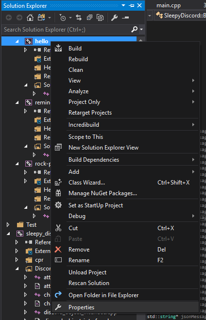
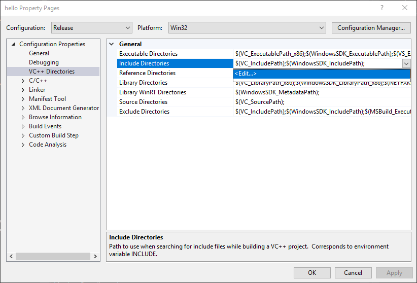
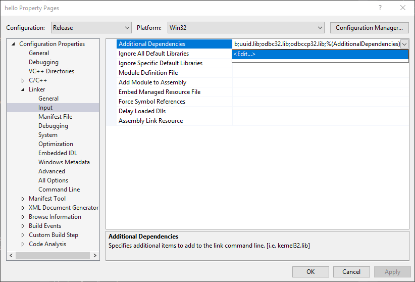

[⮌ Go back to documentation](documentation.html)

#How To Link

<aside class="notice">
I'm going to assume that you have compiled Sleepy Discord or aquired a compiled binary
</aside>

* [CMake](#cmake)
* [G++](#g)
* [Visual Studio](#visual-studio)

#CMake
```cmake
cmake_minimum_required (VERSION 3.6)
project(example)

add_subdirectory(sleepy-discord)

add_executable(hello source.cpp)

target_link_libraries(hello sleepy-discord)
```

To link Sleepy Discord using CMake, simply add two lines of cmake code to your CMakeList.txt, ``add_subdirectory(sleepy-discord)`` and ``target_link_libraries(hello sleepy-discord)``.

#G++

```shell
cd ./examples/hello/
g++ -std=c++11 -I ../../include -I ../../deps -I ../../deps/include -I ../../include/sleepy_discord/IncludeNonexistent example0.cpp -L../../buildtools -L/usr/lib -lsleepy_discord -lcurl -lssl -lcrypto -lpthread -o example.out
```

This example command should compile and link the example code in examples/hello to Sleepy Discord with G++. Please note that this example assumes that libcurl.a, libssl.a, and libcrypto.a are located in /usr/lib.

**Preparing:** Before we start, we need the needed libraries. This depends on the libraries that you'll be using with Sleepy Discord. For example, to use CPR, you need the a compiled version of CPR (or maybe you could use CMake to that for you since that's what they recommend you to do, I guess) and libcurl. Another example is to use Websocket++, you'll need, you guessed it, the openSSL library files.

##Helpful Chart
To link the Sleepy Discord with g++, you'll need to add some options (Or whatever they are called). The helpful chart below should help breakdown what all the options in the example are for.

| Option         | Example                      | Reason |
|----------------|------------------------------|--------|
| ``-std=c++11`` | ``-std=c++11``               | Lets you compile c++11 code, you can change this to something higher then 11 if you like. |
| ``-I``         | ``-I/path/to/includes``      | Tells the compiler where to look for header files and other files to include. IMPORTANT NOTE: Order matters, make sure ``include/sleepy_discord/IncludeNonexistant`` is last. |
| ``-L``         | ``-L/path/to/library/files`` | Tells the compiler where to look for lib files |
|                | ``example.cpp``              | The files you want to compile. NOTE: these should before any ``-l`` |
| ``-l``         | ``-llib``                    | Tells the compiler which libraries to link with |
| ``-D``         | ``-DSomeVariable``           | Defines preprocessor variable |
| ``-o``         | ``-o example.out``           | The output file |

Once that's all done, [move over to the last final step.](#now-its-time-to-compile)

#Visual Studio

##Preparing
Before we start, if are using a library that needs curl, for example cpr, then you need to compile it. If you used setup.py to download cpr, it should have also download curl for you in ``sleepy_discord\deps\cpr\opt\curl``.

> Here what the commands should look like for compiling curl

```shell
"C:\Program Files (x86)\Microsoft Visual Studio\2017\Community\VC\Auxiliary\Build\vcvars32.bat"
cd ..\..\sleepy-discord\deps\cpr\opt\curl\winbuild
nmake /f Makefile.vc mode=static VC=14
```

Here's a good guide to do just that, but before you read it remember to change things like ``Microsoft Visual Studio 12.0`` or ``VC=12`` or ``vc12`` to ``Microsoft Visual Studio 14.0`` or ``VC=14`` or ``vc14`` or whatever version of Visual Studio. [Anyway, here is the guide that I'm talking about.](https://stackoverflow.com/a/32168255) After you have compiled curl, place the include and lib folders into deps.

##Open Properties

**Step 1:** First you need a project, of course. Go make a new one if you haven't done so already.

**Step 2:** Right click on your project in the Solution Explorer and go to Properties.



<aside class="notice">
Alt+F7 also works if you have only one project in your solution.
</aside>

**Step 3:** Look at the top of the properties window, see where it says Configuration and Platform. Set both to All.

##Include Directories

**Step 4:** On the left, go to VC++ Directories. Click on Include Directories and then click on the arrow on the right, and then click ``Edit...``



**Step 5:** Click on the white empty box at the top, and then click on the 3 dots on the right.

> The box of Include Directories should look something like this, but with the full path

```bash
$(projectdir)..\include
$(projectdir)..\deps
$(projectdir)..\deps\include
$(projectdir)..\include\sleepy_discord\IncludeNonexistent
```

**Step 6:** Select the folder containing the folder ``sleepy_discord``, and do the same for the dependencies(``deps``), include dependencies (``deps/include``), and the ``\include\sleepy_discord\IncludeNonexistent``. Also, it is important to note that the order of these folders matter. The compiler will look at the first path first, and and the 2nd one next, so ``\include\sleepy_discord\IncludeNonexistent`` needs to be last. This is so that we don't get "any include files not found" errors. Anyway, once done, click OK. These folders will be the folders that Visual C++ will look into to find header files for Sleepy_Discord.

##Library Directories

> The box of Library Directories should look like this, but with full paths

```bash
$(projectdir)$(Configuration)
$(projectdir)..\deps\lib
```

**Step 7:** Do the same thing for Library Directories, add the folder with Sleepy_Discord and all it's needed libraries. This tells Visual C++ to search for library files in these folders

##Add Dependencies

**Step 8:** To tell Visual C++ to link these library, click on the arrow to the left of Linker, and go to Input. Click on Additional Dependencies, and then click on the arrow on the right, and then click Edit...



> Here's a good example of the library files to list

```bash
sleepy_discord.lib
libcurl_a.lib
libcryptoMT.lib
libsslMT.lib
crypt32.lib
wldap32.lib
Normaliz.lib
```

**Step 9:** On the text box at the top add ``sleepy_discord.lib`` then add all the other needed library files you also need. The librarys you will need to link to will depend on your deps/lib folder, system, platform, and configuration. Also, each library file is separated by a new line. Once you're done, remember to click OK.

##Preprocessor Definitions

<aside class="notice">
These steps are optional, and are here just in case you need them.
</aside>

**Step 10:** Click the arrow to the left of C/C++, and go to Preprocessor. Click on Preprocessor Definitions, and then click Edit...

**Step 11:** On the text box at the top add whatever preprocessor definitions, you need. You don't need any to link Sleepy Discord. This is here just in case, you need it.

##Build
Once that's all done, [move over to the last final step.](#now-its-time-to-compile)

#Now, It's Time to Compile

> Here's some example code for you to compile

```cpp
/*If you are using uWebSockets,
  remember to change this to uwebsockets_websocket.h*/
#include "sleepy_discord/websocketpp_websocket.h"

class myClientClass : public SleepyDiscord::DiscordClient {
public:
	using SleepyDiscord::DiscordClient::DiscordClient;
	void onMessage(SleepyDiscord::Message message) {
		if (message.startsWith("whcg hello"))
			sendMessage(message.channelID, "Hello " + message.author.username);
	}
};

int main() {
	myClientClass client("token", 2);
	client.run();
}
```

And now you should be able to build without any errors.

<aside class="notice">
Remember to change ``token``` to your token if you want to run the code.
</aside>

If you did get an error, then check that you followed the instructions correctly. And, if you are still getting errors look below, search issues or post an issue on the github repository.

#Common Issues

### ‘SSL_R_SHORT_READ’ was not declared in this scope
```shell
error: ‘SSL_R_SHORT_READ’ was not declared in this scope
if (ERR_GET_REASON(ec.value()) == SSL_R_SHORT_READ) {
                                  ^~~~~~~~~~~~~~~~
```
[Check out issue #77](https://github.com/yourWaifu/sleepy-discord/issues/77)

### SleepyDiscord is not a class or namespace
Generally happens when you are missing websocket++ or uWebSockets. Take a look at the top, #include "sleepy_discord/&lt;LIBRARY&gt;_websocket.h". Check that you have the library inside ``deps/include``. if they are missing, try using the setup script again.

If not, take a look your project's include directories in the project properties. Take note of the config that's being edited (At the top of the project properties or right below the title bar, see where it says Configuration?) and the order of the directories. Make sure ``\include\sleepy_discord\IncludeNonexistent`` is last on the list. 2nd make sure the paths actually go to the correct directories.

### Cannot open file 'sleepy_discord.lib'
Try looking for ``sleepy_discord.lib``, it's likely in ``sleepy_discord/(Whatever configuration you used)`` and add that to your list of library directories. If ``sleepy_discord.lib`` isn't inside there, then [compile Sleepy Discord](compile.html).

### cannot open file 'libcurl_a.lib'
It looks like you needed libcurl and [skipped the preparing step](#preparing).

### Could not get the gateway
There's a few reasons this might happen. For one, it could mean that you aren't connect to the internet, and if that's the case then connect to the internet. 2nd, if you are using CMake, it could be that something went wrong. To fix this, delete the CMakeCache.txt file and try running CMake again. 3rd, If none of those work, it could be an issue with ssl. As a last resort, You can use the ``SLEEPY_USE_HARD_CODED_GATEWAY`` Preprocessor.

### unresolved external symbol __imp__ldap_init
According to [the Windows Docs](https://docs.microsoft.com/en-us/previous-versions/windows/desktop/api/winldap/nf-winldap-ldap_init), this symbol is defined in ``Wldap32.lib``. So linking ``Wldap32.lib`` should fix this issue.

### unresolved external symbol __imp__IdnToAscii

According to [the Windows Docs](https://docs.microsoft.com/en-us/windows/desktop/api/winnls/nf-winnls-idntounicode), this symbol is defined in ``Normaliz.lib``. So linking ``Normaliz.lib`` should fix this issue.